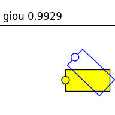
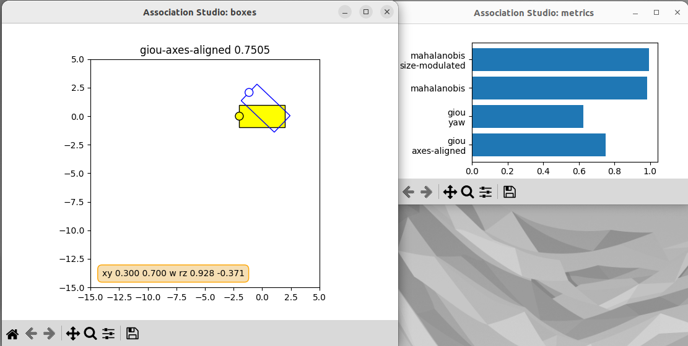
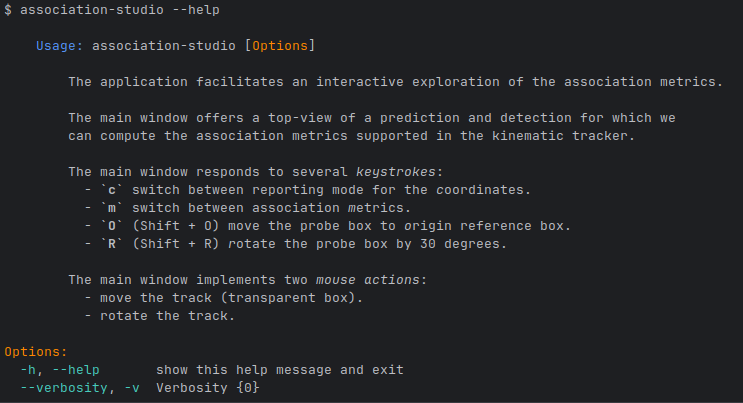

# Association studio

The app helps to analyze the actually existing implementations of the association metrics.
The analysis implies computing the metric values in a GUI featuring two bounding boxes.
The user is able to move and rotate one of the boxes. The values of the currently selected
association metrics are calculated and represented instantly.



## Usage 

There is a matplotlib-driven GUI

```shell
association-studio
```



Checkout the active keystrokes and mouse events in the brief usage description:

```shell
association-studio --help
```




## Install

```shell
pip install association-studio
```


